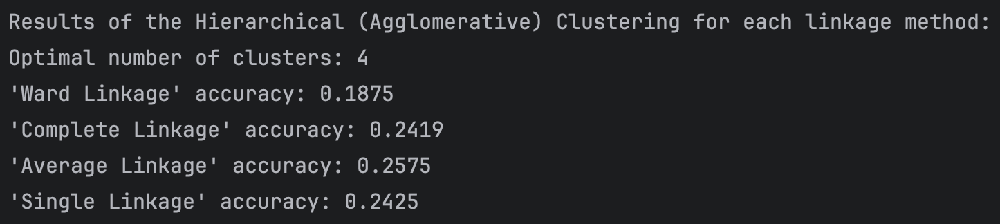
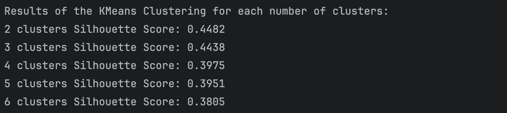
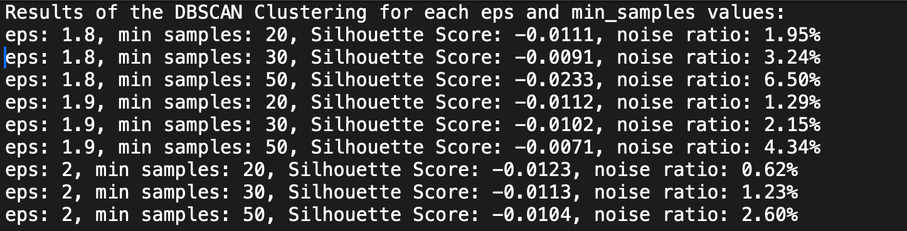
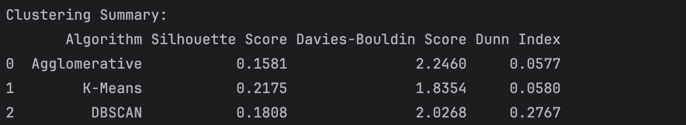

# Automobile Customer Segmentation (Clustering) Project
## Data Analyzed
An automobile company has plans to enter new markets with their existing products (P1, P2, P3, P4 and P5). 
After intensive market research, they’ve deduced that the behavior of new market is similar to their existing market.
In their existing market, the sales team has classified all customers into 4 segments (A, B, C, D ). Then, they 
performed segmented outreach and communication for different segment of customers. This strategy has work 
exceptionally well for them. They plan to use the same strategy on new markets and have identified potential 
customers.
The dataset provides the details of the existing and potential customers of the company based on the purchase 
history and the corresponding segments they have been classified into.
## Variable description
- `CustomerID` : unique customer ID
- `Gender` : gender of the customer
- `Married` : marital status of the customer
- `Age` : age of the customer
- `Graduated` : specifies whether the customer a graduate?
- `Profession` : profession of the customer
- `WorkExperience` : work experience of the customer in years
- `SpendingScore` : spending score of the customer
- `FamilySize` : number of family members of the customer (including the customer)
- `Category` : anonymised category for the customer
- `Segmentation` : (target variable) customer segment of the customer
## Methods Used
For the analysis Clustering methods where used. It is an unsupervised machine-learning technique of division of the 
dataset into groups in which the members in the same group possess similarities in features. \
Clustering techniques used:
- **Hierarchical (Agglomerative) clustering** - is an algorithm that groups similar objects into groups called clusters;
- **K-Means clustering** - is a method of vector quantization, that aims to partition n observations into 
k clusters in which each observation belongs to the cluster with the nearest mean (cluster centers 
or cluster centroid), serving as a prototype of the cluster; 
- **Density-Based Spatial Clustering of Applications with Noise (DBSCAN)** - is a density-based clustering 
non-parametric algorithm: given a set of points in some space, it groups together points that are closely packed 
(points with many nearby neighbors), and marks as outliers points that lie alone in low-density regions (those whose 
nearest neighbors are too far away).
## Data Preprocessing
Dimensionality Reduction with Principal Component Analysis (PCA) is a technique used to emphasize variation and capture 
strong patterns in a dataset. It transforms the data into a new set of variables, the principal components, which are 
orthogonal (uncorrelated), ensuring that the first principal component captures the most variance, and each succeeding 
one, less so.
## Evaluation metrics
- **Silhouette Score** - the overall silhouette score is the average silhouette score for all points in the dataset. It 
provides a single measure of the overall clustering quality.
- **Davies-Bouldin score** - the score is defined as the average similarity measure of each cluster with its most similar 
cluster, where similarity is the ratio of within-cluster distances to between-cluster distances. Thus, clusters which 
are farther apart and less dispersed will result in a better score.
- **Dunn index (DI)** - is an internal evaluation scheme, where the result is based on the clustered data itself. Higher 
the Dunn index value, better is the clustering. The number of clusters that maximizes Dunn index is taken as the 
optimal number of clusters k.
## Supporting methods
- Elbow method to determine the optimal number of clusters in Hierarchical clustering and K-Means method;
- Within-Cluster Sum of Squares (WCSS) to assess quality of clusters;
- Squared Euclidean Distances.
## Results Interpretation
A particular clustering algorithm outperforms others on particular dataset depending on dataset's structure, shape, 
density and noise):\
- K-Means: Best for compact, well-separated clusters with minimal noise.
- DBSCAN: Ideal for datasets with arbitrary-shaped clusters, noise, and outliers.
- Agglomerative Clustering: Useful for smaller datasets with hierarchical relationships.

## Project Requirements
1. Select a dataset.
2. Clean and preprocess the obtained data.
3. Implement three clustering methods: K-means, DBSCAN, and Agglomerative.
4. Use the elbow method to determine the optimal number of clusters for K-means and Agglomerative methods.
5. For the Agglomerative method, draw a dendrogram.
6. Identify the best parameters.
7. Evaluate the obtained results using three clustering quality metrics: Silhouette index, Davies-Bouldin score, 
and Dunn score.
8. Visualize the resulting clusters.
9. Explain why one algorithm performs better than the others in your case.
10. Present the results.
## Resources
[Automobile Customer Segmentation Dataset](https://www.kaggle.com/datasets/akashdeepkuila/automobile-customer)
